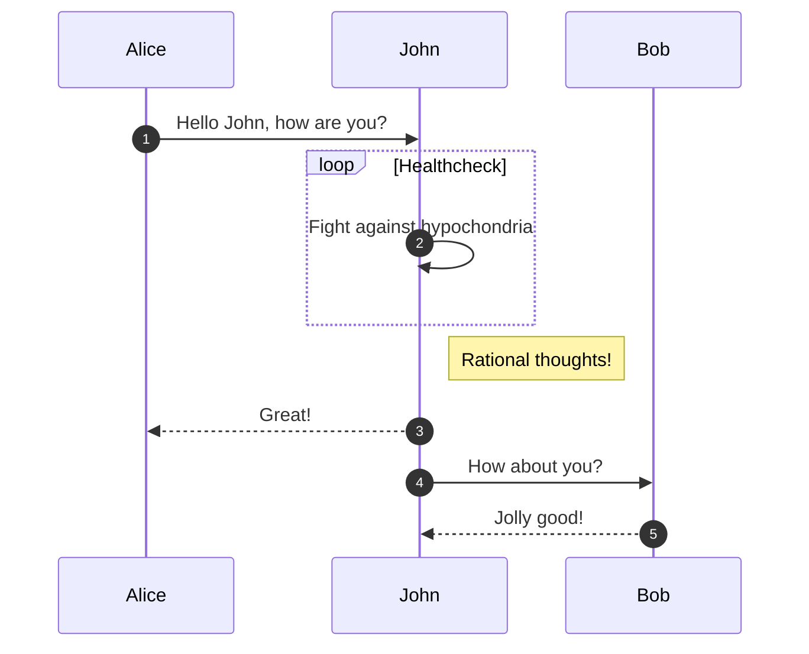

# Mermaid
With mermaid, you can create a number of different charts and diagrams like sequence diagrams, gantt charts, user journeys and more.  

## Syntax
See the [official documentation](https://mermaid.js.org/) for syntax and more examples.

## Example
The below markdown

!!! example

    ````markdown
    ```mermaid
    sequenceDiagram
        autonumber
        Alice->>John: Hello John, how are you?
        loop Healthcheck
            John->>John: Fight against hypochondria
        end
        Note right of John: Rational thoughts!
        John-->>Alice: Great!
        John->>Bob: How about you?
        Bob-->>John: Jolly good!
    ```
    ````


Will render

