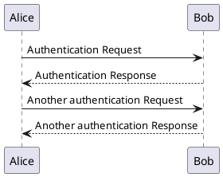

# PlantUML

You can use PlantUML to render UML diagrams. For more information, see the [official documentation](http://plantuml.com/).

You can simply add a UML diagram as in the following markdown code block.

````markdown
```plantuml format="png" classes="uml myDiagram" alt="My super diagram placeholder" title="My super diagram" width="300px" height="300px"
    Goofy ->  MickeyMouse: calls
    Goofy <-- MickeyMouse: responds
```
````

will render the following diagram:

```plantuml format="png" classes="uml myDiagram" alt="My super diagram placeholder" title="My super diagram" width="300px" height="300px"
    Goofy ->  MickeyMouse: calls
    Goofy <-- MickeyMouse: responds
```

or as in the following markdown code block: 

````markdown

````

will render the following diagram:


!!! note
    Supported values for `format` parameter are:

    * png: HTML img tag with embedded png image
    * svg: HTML img tag with embedded svg image (links are not navigable)
    * svg_inline: HTML5 svg tag with inline svg image source (links are navigable, can be manipulated with CSS rules)
    * txt: plain text diagrams.


## Including PlantUML files or URLs

Including files can help structure your documentation and repository, and also allow reuse of diagrams.

If you want to include diagrams from another location in your docs repository you can use the `!include` directive. Given a file located at `docs/diagrams/diagram.puml` with the following contents:

```
@startuml
Alice -> Bob: Authentication Request
return
@enduml
```

It can be included in any page with:

````markdown
```plantuml
!include docs/diagrams/diagram.puml
```
````

This will render:

```plantuml
!include docs/diagrams/diagram.puml
```

See the [official documentation](https://plantuml.com/preprocessing#46386ca62d71e8f2) on including files and URLs for more information, for example how to reuse individual components in multiple diagrams.

!!! Note
    Note that the PlantUML plugin and preprocessor is run from the root of the repository, meaning the `docs/` folder needs to be included in the `!include` path.

## C4 model

If you are using the [C4 model](https://c4model.com/) for visualizing your software architecture you might want to use [C4-PlantUML bindings](https://github.com/plantuml-stdlib/C4-PlantUML) to render diagrams in the domain language and standardize C4 formatting:

````markdown
```plantuml format="svg"
    @startuml Basic Sample
    !includeurl https://raw.githubusercontent.com/plantuml-stdlib/C4-PlantUML/v2.0.1/C4_Container.puml

    Person(admin, "Administrator")
    System_Boundary(c1, "Sample System") {
        Container(web_app, "Web Application", "C#, ASP.NET Core 2.1 MVC", "Allows users to compare multiple  Twitter timelines")
    }
    System(twitter, "Twitter")

    Rel(admin, web_app, "Uses", "HTTPS")
    Rel(web_app, twitter, "Gets tweets from", "HTTPS")
    @enduml
```
````

```plantuml format="svg"
@startuml Basic Sample
!includeurl https://raw.githubusercontent.com/plantuml-stdlib/C4-PlantUML/v2.0.1/C4_Container.puml

Person(admin, "Administrator")
System_Boundary(c1, "Sample System") {
    Container(web_app, "Web Application", "C#, ASP.NET Core 2.1 MVC", "Allows users to compare multiple Twitter timelines")
}
System(twitter, "Twitter")

Rel(admin, web_app, "Uses", "HTTPS")
Rel(web_app, twitter, "Gets tweets from", "HTTPS")
@enduml
```
